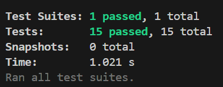

# 📐 String Calculator (JavaScript)

A simple yet extensible string calculator that supports multiple custom formats and delimiters. 
Built using JavaScript and tested with [Jest](https://jestjs.io/).

---

## ✨ Features

- Return 0 for an empty string
- Add numbers separated by commas
- Handle newline `\n` as a valid delimiter
- Support unknown number of inputs
- Support custom single or multi-character delimiters
- Support multiple delimiters at once
- Throw exception for negative numbers
- Ignore numbers greater than 1000

---

## 🧪 Test Cases

| #  | Input                              | Output                     | Description                                      |
|----|------------------------------------|----------------------------|--------------------------------------------------|
| 1  | `""`                               | `0`                        | Empty string returns 0                          |
| 2  | `"1"`                              | `1`                        | Single number                                   |
| 3  | `"1,2"`                            | `3`                        | Two comma-separated numbers                     |
| 4  | `"1,2,3,4,5,6,7,8,9,0"`            | `45`                       | Multiple comma-separated numbers                |
| 5  | `"1\n2\n3"`                        | `6`                        | Newlines between numbers                        |
| 6  | `"1,2\n3"`                         | `6`                        | Mix of newline and comma                        |
| 7  | `"\n"`                             | `0`                        | Only newline                                    |
| 8  | `","`                              | `0`                        | Only comma                                      |
| 9  | `"1;2;3"`                          | `6`                        | Semicolon delimiter support                     |
| 10 | `"1;2;\n,3"`                       | `6`                        | Mix of `\n`, `,`, and `;` delimiters            |
| 11 | `"//;\n1;2"`                       | `3`                        | Custom single-character delimiter (`;`)         |
| 12 | `"1,-2,3,-4"`                      | ❌ Throws                  | Throws: `negative numbers not allowed -2,-4`    |
| 13 | `"2,1001"`                         | `2`                        | Ignores numbers > 1000                          |
| 14 | `"//[***]\n1***2***3"`             | `6`                        | Custom delimiter of any length (`***`)          |
| 15 | `"//[*][%]\n1*2%3"`                | `6`                        | Multiple custom delimiters (`*`, `%`)           |

## 💯Test Results

